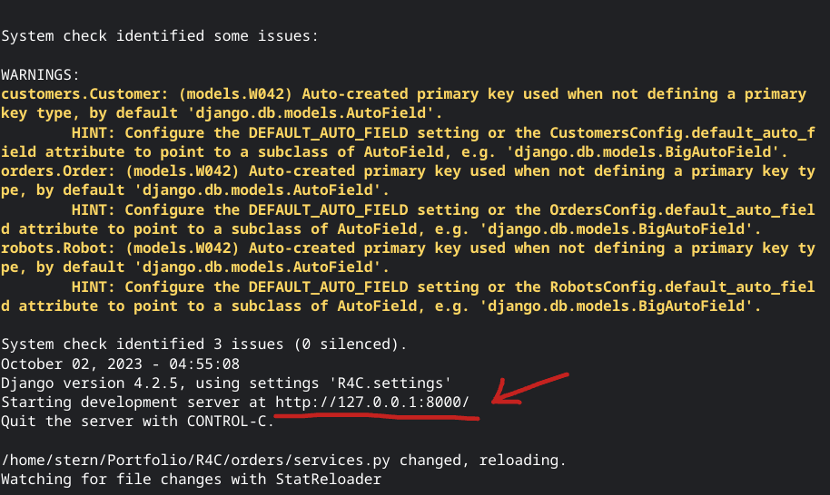
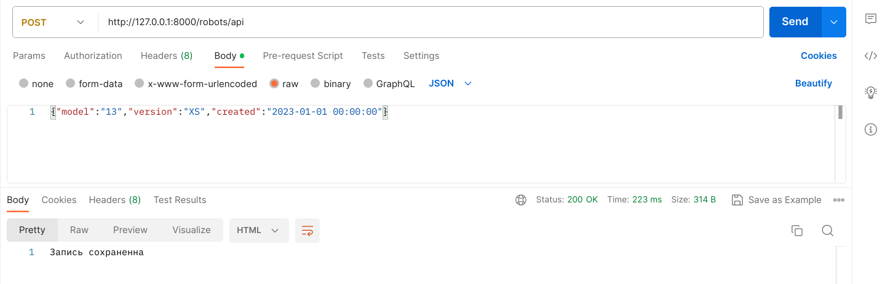
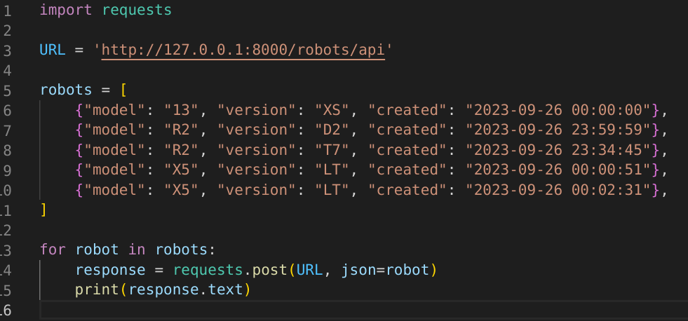

# Инструкция по использованию данного проекта
## Task 1. Для технического специалиста компании.
**Добавление записи в БД**: Для добовления записи в БД можно использовать 2 метода: через Postman или через Python с библиотекой requests.
### Через Postman
- Включите локальный сервер Django с этим проектом
- Скопируйте адрес локального сервера с терминала/консоли(См. рис. 1)

- Откройте Postman
- Откройте Body и в raw введите данные в формате {'model': <номер модели>, 'version': <номер версии>, 'created': <дата создания>}(См. рис. 2)
##### !!! ВНИМАНИЕ !!! В raw отправляй данные только для 1 записи! 1 запрос - 1 запись!
- Отправьте POST-запрос на адрес <ваш локальный сервер>/robots/api. В ответ вы должны получить "Запись сохранена, а в БД в таблице robots_robot сохраниться ваша запись

### Через Python
- Включите локальный сервер Django с этим проектом
- Скопируйте адрес локального сервера с терминала/консоли(См. рис. 1)
- Откройте файл request_api.py, который находиться в папке проекта
- Введите в переменную local_host адрес вашего локального хоста
- Введите в список/массив robots нужные данные (См. рис. 3)
- Запустите скрипт через консоль

## Task 2. Для директора компании.

## Task 3. Для клиента компании.